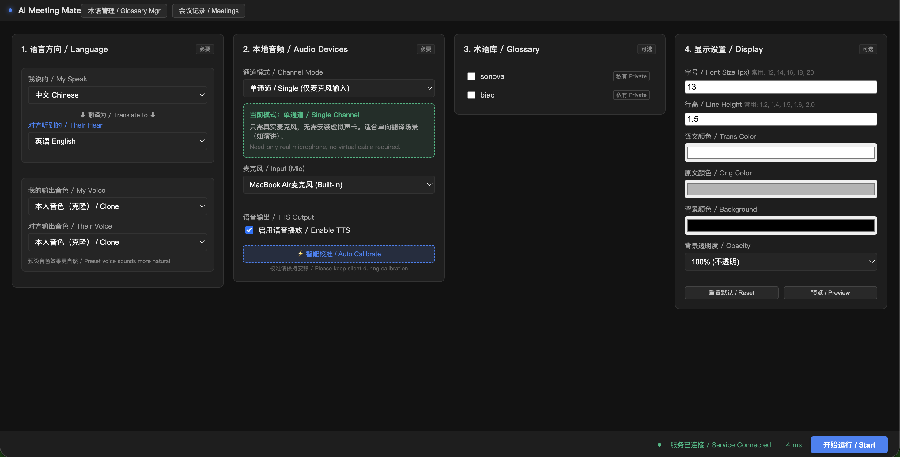
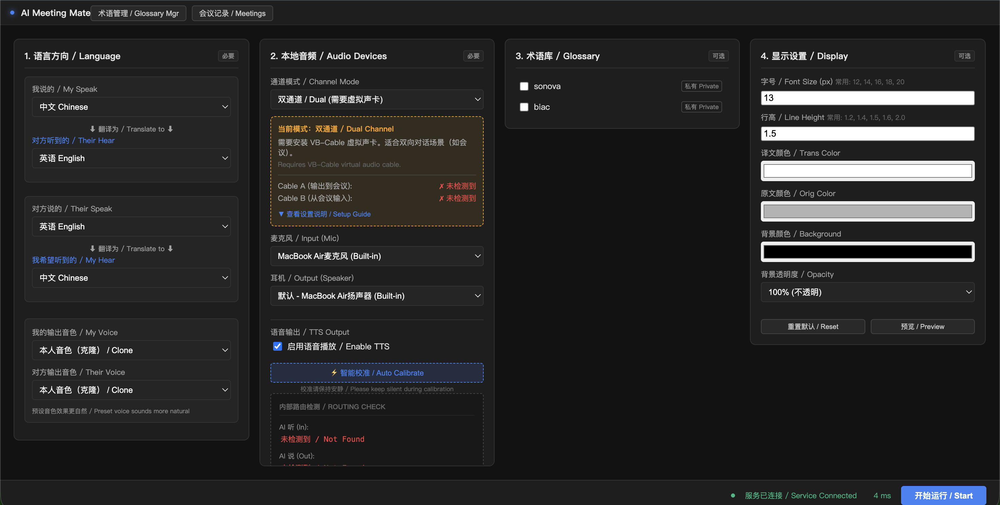
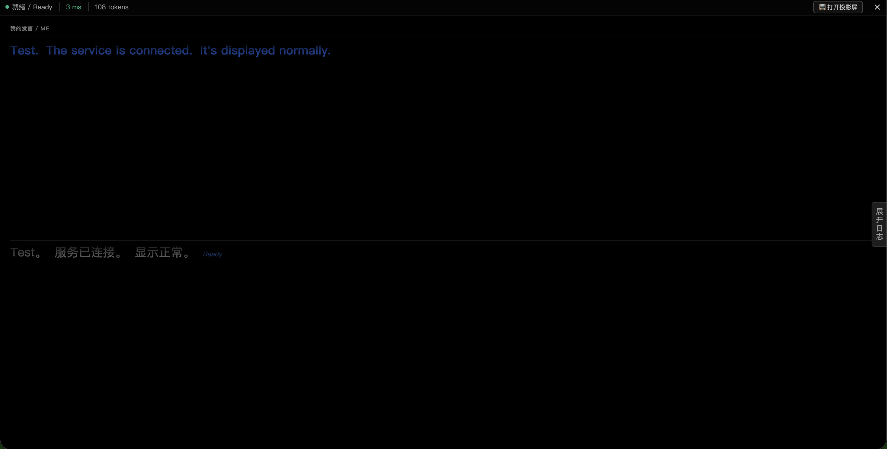
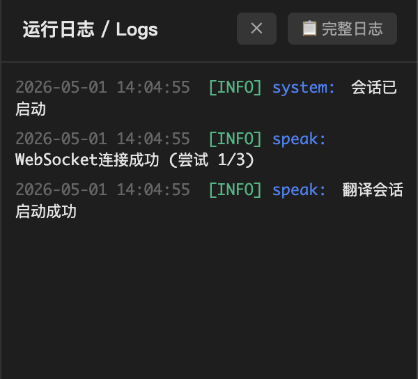
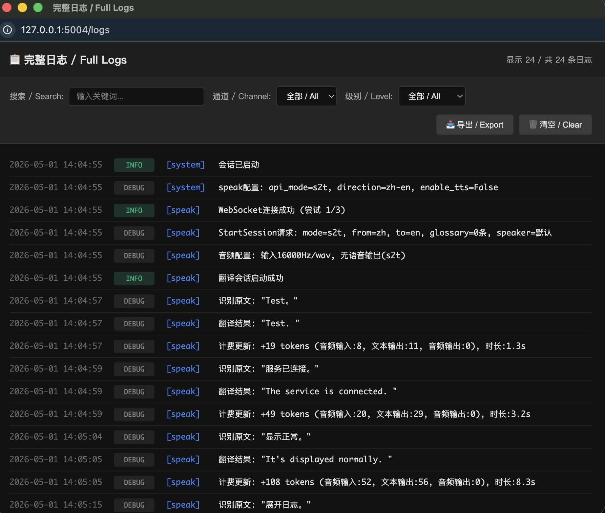
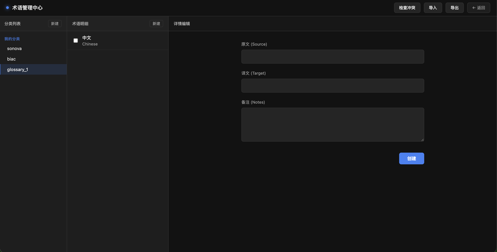
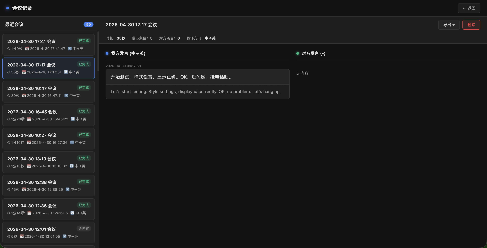

# AI 同声传译助手 (开源版) | AI Simultaneous Interpreter (Open Source)

[中文](#中文) | [English](#english)

---

## 关于本项目

本项目 fork 自 [masichong408/simultaneous-interpreter](https://github.com/masichong408/simultaneous-interpreter)，在保留原项目核心功能的基础上，进行了大量定制开发和优化改进。如需了解原项目，请访问上游仓库。

---

## 中文

基于火山引擎同声传译 API 的实时翻译工具，支持双通道会议翻译、术语管理和会议记录。

### 相较于原项目的改进

#### 新增功能

- **配置页面显示设置**：在配置页面可直接预设字体大小、行高、文字颜色、背景颜色、背景透明度，无需打开显示窗口后再调整
- **TTS 语音输出开关**：可单独关闭语音输出，仅保留文字翻译（节省 API 费用）
- **单/双通道模式切换**：单通道模式无需虚拟声卡，降低使用门槛
- **实时日志侧边栏**：运行时可查看 INFO/WARNING/ERROR 级别日志，支持打开完整日志页面（搜索、过滤、导出）
- **Token 计费显示**：实时显示 API 调用消耗的 token 数
- **虚拟声卡检测状态**：双通道模式下显示 Cable A/B 检测状态

#### 优化改进

- **移除强制引导弹窗**：原项目每次重启后强制显示音频路由设置弹窗，现已移除并整合到配置页面
- **四列布局优化**：配置页面改为语言/音频/术语/显示四列布局，避免内容溢出
- **列高独立适应**：各配置列高度独立变化，可单独滚动
- **代码重构**：提取工具函数、使用 CSS 类管理状态、消除重复代码

### 功能

- **实时同声传译**：基于火山引擎 AST API，支持中英日法德西葡印尼等多语言互译
- **单/双通道模式**：
  - **单通道模式**：无需虚拟声卡，仅翻译麦克风输入（适合个人使用）
  - **双通道模式**：安装虚拟声卡后，可同时翻译"我的发言"和"对方发言"
- **TTS 语音输出（可开关）**：翻译结果可选通过 PCM 流式播放，支持预设音色和声音克隆
- **独立显示窗口**：翻译结果可在独立窗口展示，支持自定义字体大小、颜色、背景
- **音频美化**：低通滤波 + 高频衰减 + 动态压缩，输出更自然柔和
- **术语管理**：支持分类管理、CSV 导入导出、会议中临时添加术语并热更新
- **会议记录**：自动保存双语转写记录，支持 TXT/MD 格式导出
- **断线自动恢复**：网络中断后自动重连并恢复翻译会话
- **配置向导**：首次使用时引导完成音频路由配置

### 界面预览

#### 配置页面


*单通道模式：无需虚拟声卡，适合个人使用*


*双通道模式：显示虚拟声卡检测状态和帮助说明*

#### 运行界面


*运行中：实时显示译文和原文*


*投影屏：独立窗口展示，支持自定义样式*

#### 日志功能


*实时日志侧边栏：查看 INFO/WARNING/ERROR 级别日志*


*完整日志页面：支持搜索、过滤、导出*

#### 功能页面


*术语管理：支持分类管理、CSV 导入导出*


*会议记录：自动保存双语转写，支持导出*

---

### 快速开始

#### 1. 环境要求

- Python 3.10+
- 浏览器：推荐 Chrome 或 Edge（AudioWorklet 支持最好，Safari 部分功能受限）
- 火山引擎账号，开通[同声传译 API](https://www.volcengine.com/product/ast)
- 麦克风权限：本地运行时使用 `http://127.0.0.1` 或 `http://localhost` 访问（浏览器允许非 HTTPS 下访问麦克风）

#### 2. 安装

```bash
git clone https://github.com/masichong408-afk/simultaneous-interpreter.git
cd simultaneous-interpreter
pip install -r requirements.txt
```

#### 3. 申请火山引擎 API 密钥

本项目需要两个密钥：`VOLCANO_APP_KEY`（应用密钥）和 `VOLCANO_ACCESS_KEY`（账号访问密钥），按以下步骤获取：

**第一步：注册并实名认证**

1. 访问 [火山引擎官网](https://www.volcengine.com/)，点击右上角注册/登录
2. 完成实名认证（个人或企业均可），认证后才能开通服务

**第二步：开通豆包同声传译 2.0 大模型服务**

1. 进入 [语音技术控制台](https://console.volcengine.com/speech/app)
2. 在左侧导航栏点击「服务列表」，找到「**豆包同声传译 2.0 大模型**」并开通（有免费试用额度）
3. 注意：请选择「豆包同声传译 2.0 大模型」，不要选旧版同声传译服务

**第三步：创建应用，获取 App Key**

1. 在语音技术控制台，点击「应用管理」→「创建应用」
2. 填写应用名称，在「接入能力」中勾选「豆包同声传译 2.0 大模型」
3. 创建完成后，在应用列表中查看 **App Key**（即 `VOLCANO_APP_KEY`）

**第四步：获取 Access Key**

1. 点击控制台右上角头像 →「API 访问密钥」，或直接访问 [密钥管理页面](https://console.volcengine.com/iam/keymanage/)
2. 点击「新建密钥」，创建后记录 **Access Key ID**（即 `VOLCANO_ACCESS_KEY`）和 **Secret Access Key**
3. Secret Access Key 只在创建时显示一次，请妥善保存

> 如果遇到权限问题，前往「访问控制」→「用户管理」→「关联策略」，添加 `SAMIFullAccess` 权限。

**第五步：配置到项目中**

```bash
cp .env.example .env
```

编辑 `.env` 文件，填入获取的密钥：

```
VOLCANO_APP_KEY=your_app_key
VOLCANO_ACCESS_KEY=your_access_key
```

#### 4. 启动

```bash
python wsgi.py
```

浏览器打开 `http://127.0.0.1:5004` 即可使用。

### 使用模式

#### 单通道模式（推荐，无需虚拟声卡）

适合：个人使用、演讲翻译、仅需文字显示

1. 通道模式选择「单通道 / Single」
2. 语言方向：选择源语言和目标语言
3. TTS 输出：根据需要开启/关闭
4. 选择麦克风，点击"开始运行"

翻译文字实时显示，无需虚拟声卡。

#### 双通道模式（需要虚拟声卡）

适合：双向会议、Zoom/Teams 等在线会议

安装 VB-Cable A+B 后：

1. 通道模式选择「双通道 / Dual」
2. 会议软件：扬声器设为 `Cable B`，麦克风设为 `Cable A`
3. 打开本页面，系统自动检测 Cable A/B 并完成路由
4. 耳机监听对方翻译后的音频

首次使用时页面会弹出配置向导，按步骤操作即可。

#### 虚拟声卡安装

- **Windows / macOS**: [VB-Audio Cable A+B](https://vb-audio.com/Cable/) — 下载后以管理员身份安装，需要安装 Cable A 和 Cable B 两个驱动

#### 独立显示窗口

点击「📺 显示窗口」按钮，可在独立窗口展示翻译结果：

- 上栏显示译文，下栏显示原文
- 点击右上角 ⚙️ 可自定义：字体大小、行高、文字颜色、背景颜色
- 设置自动保存，下次打开保持原样
- 适合投屏展示或辅助阅读

### 技术架构

```
浏览器 (Web Audio API + AudioWorklet)
  ↕ Socket.IO
Flask 后端 (本地 Python 进程)
  ↕ WebSocket (Protobuf)
火山引擎 AST API (同声传译 + TTS)
```

- **前端**：原生 JS，AudioWorklet PCM 流式播放，Silero VAD 语音检测
- **后端**：Flask + Flask-SocketIO，SQLite 存储术语和会议记录
- **通信**：Socket.IO 双向实时通信，Protobuf 编码与 API 交互

### 项目结构

```
simultaneous-interpreter/
├── app/
│   ├── __init__.py          # Flask 应用工厂
│   ├── config.py            # 配置（从 .env 读取）
│   ├── models.py            # 数据模型（术语、会议）
│   ├── socket_handlers.py   # Socket.IO 事件处理
│   ├── routes/              # HTTP 路由
│   ├── services/            # 火山引擎翻译服务
│   ├── templates/           # HTML 页面
│   │   ├── index.html       # 主控制台
│   │   ├── display.html     # 独立显示窗口
│   │   ├── glossary.html    # 术语管理
│   │   └── meetings.html    # 会议记录
│   └── static/
│       ├── js/              # 前端逻辑
│       │   ├── translator.js
│       │   ├── audio-processor.js
│       │   └── pcm-player-processor.js
│       └── vad/             # Silero VAD 模型
├── python_protogen/         # Protobuf 生成文件
├── requirements.txt
├── CHANGELOG.md             # 更新记录
├── .env.example
└── wsgi.py                  # 入口
```

### 许可证

MIT License

---

## English

A real-time translation tool built on the Volcano Engine Simultaneous Translation API, supporting dual-channel meeting translation, glossary management, and meeting transcription.

### Improvements Over Original Project

#### New Features

- **Display Settings in Config Panel**: Preset font size, line height, text color, background color, and opacity directly in the configuration page
- **TTS Output Toggle**: Enable/disable voice output independently to save API costs
- **Single/Dual Channel Mode**: Single-channel mode requires no virtual audio cable
- **Real-time Log Sidebar**: View INFO/WARNING/ERROR logs during operation, with full log page (search, filter, export)
- **Token Billing Display**: Real-time display of API token consumption
- **Virtual Cable Detection Status**: Shows Cable A/B detection status in dual-channel mode

#### Improvements

- **Removed Mandatory Guide Popup**: Audio routing guide integrated into config page instead of showing on every restart
- **Four-Column Layout**: Config page uses language/audio/glossary/display columns to prevent overflow
- **Independent Column Heights**: Each column scrolls independently
- **Code Refactoring**: Extracted utility functions, use CSS classes for state management, eliminated duplicate code

### Features

- **Real-time Simultaneous Translation**: Powered by Volcano Engine AST API, supporting multi-language translation including Chinese, English, Japanese, French, German, Spanish, Portuguese, Indonesian, and more
- **Dual-channel Translation**: With a virtual audio cable installed, translate both "my speech" and "the other party's speech" simultaneously
- **Single-channel Mode**: No virtual audio cable needed — translates microphone input only (great for a quick start)
- **TTS Voice Output**: Translation results are played back via PCM streaming, with support for preset voices and voice cloning
- **Audio Enhancement**: Low-pass filter + high-frequency attenuation + dynamic compression for smoother, more natural output
- **Glossary Management**: Categorized glossary management, CSV import/export, and on-the-fly term addition with hot-reload during meetings
- **Meeting Transcription**: Automatically saves bilingual transcription records, exportable in TXT/MD format
- **Auto-reconnection**: Automatically reconnects and resumes the translation session after network interruptions
- **Setup Wizard**: Guided audio routing configuration on first use

### Screenshots

See [Chinese section](#界面预览) for screenshots.

---

### Quick Start

#### 1. Requirements

- Python 3.10+
- Browser: Chrome or Edge recommended (best AudioWorklet support; Safari has limited functionality)
- A Volcano Engine account with the [Simultaneous Translation API](https://www.volcengine.com/product/ast) enabled
- Microphone permission: Access via `http://127.0.0.1` or `http://localhost` when running locally (browsers allow microphone access over non-HTTPS for localhost)

#### 2. Installation

```bash
git clone https://github.com/masichong408-afk/simultaneous-interpreter.git
cd simultaneous-interpreter
pip install -r requirements.txt
```

#### 3. Apply for Volcano Engine API Keys

This project requires two keys: `VOLCANO_APP_KEY` (application key) and `VOLCANO_ACCESS_KEY` (account access key). Follow these steps:

**Step 1: Register and Complete Identity Verification**

1. Visit [Volcano Engine](https://www.volcengine.com/) and click Register/Login in the top right corner
2. Complete identity verification (personal or enterprise). Services can only be activated after verification.

**Step 2: Enable the Doubao Simultaneous Translation 2.0 Model Service**

1. Go to the [Speech Technology Console](https://console.volcengine.com/speech/app)
2. Click "Service List" in the left sidebar, find "**Doubao Simultaneous Translation 2.0 Model**" and enable it (free trial quota available)
3. Note: Make sure to select "Doubao Simultaneous Translation 2.0 Model", not the legacy translation service

**Step 3: Create an Application and Get the App Key**

1. In the Speech Technology Console, click "Application Management" → "Create Application"
2. Enter an application name and check "Doubao Simultaneous Translation 2.0 Model" under "Access Capabilities"
3. After creation, find the **App Key** in the application list (this is your `VOLCANO_APP_KEY`)

**Step 4: Get the Access Key**

1. Click your avatar in the top right corner → "API Access Key", or visit the [Key Management page](https://console.volcengine.com/iam/keymanage/) directly
2. Click "Create Key" and record the **Access Key ID** (this is your `VOLCANO_ACCESS_KEY`) and **Secret Access Key**
3. The Secret Access Key is only shown once at creation time — save it securely

> If you encounter permission issues, go to "Access Control" → "User Management" → "Associate Policy" and add the `SAMIFullAccess` policy.

**Step 5: Configure the Project**

```bash
cp .env.example .env
```

Edit the `.env` file and enter your keys:

```
VOLCANO_APP_KEY=your_app_key
VOLCANO_ACCESS_KEY=your_access_key
```

#### 4. Start

```bash
python wsgi.py
```

Open `http://127.0.0.1:5004` in your browser to start using the app.

### Usage Modes

#### Single-channel Mode (No Virtual Audio Cable)

Open the web page, select your microphone, and click "Start". Translation results are played through the speaker.
Ideal for personal practice or simple scenarios.

#### Dual-channel Mode (Requires Virtual Audio Cable)

After installing VB-Cable A+B:

1. Meeting software: Set the speaker to `Cable B` and the microphone to `Cable A`
2. Open this page — the system will automatically detect Cable A/B and configure the audio routing
3. Listen to the translated audio of the other party through your headphones

A setup wizard will appear on first use — just follow the steps.

#### Virtual Audio Cable Installation

- **Windows / macOS**: [VB-Audio Cable A+B](https://vb-audio.com/Cable/) — Download and install as administrator. You need to install both the Cable A and Cable B drivers.

### Technical Architecture

```
Browser (Web Audio API + AudioWorklet)
  ↕ Socket.IO
Flask Backend (Local Python Process)
  ↕ WebSocket (Protobuf)
Volcano Engine AST API (Simultaneous Translation + TTS)
```

- **Frontend**: Vanilla JS, AudioWorklet PCM streaming playback, Silero VAD voice activity detection
- **Backend**: Flask + Flask-SocketIO, SQLite for glossary and meeting records
- **Communication**: Socket.IO bidirectional real-time messaging, Protobuf encoding for API interaction

### Project Structure

```
simultaneous-interpreter/
├── app/
│   ├── __init__.py          # Flask app factory
│   ├── config.py            # Configuration (reads from .env)
│   ├── models.py            # Data models (glossary, meetings)
│   ├── socket_handlers.py   # Socket.IO event handlers
│   ├── routes/              # HTTP routes
│   ├── services/            # Volcano Engine translation services
│   ├── templates/           # HTML templates
│   └── static/
│       ├── js/              # Frontend logic
│       └── vad/             # Silero VAD model
├── python_protogen/         # Protobuf generated files
├── requirements.txt
├── .env.example
└── wsgi.py                  # Entry point
```

### License

MIT License
